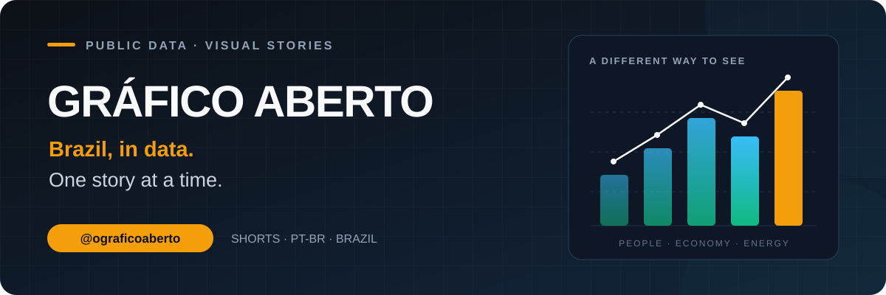

<p align="center">
  <a href="https://www.youtube.com/@ograficoaberto">
    
  </a>
</p>

<p align="center">
  <a href="https://www.youtube.com/@ograficoaberto"></a>
  
  
</p>

<p align="center"><strong>Public data. Clear charts. Stories about the Brazil we live in.</strong></p>

## Meet the channel

**Gráfico Aberto** turns public datasets and research into visual stories in Brazilian Portuguese. Demographics, everyday economics, energy, transport and industry become short, narrated explanations, with longer videos for topics that need more room.

This repository is the channel's **production archive**: scripts, artwork, charts, narration, subtitles, video exports and production records. It lets you look behind the finished videos and follow how a story was made.

**[Watch the channel →](https://www.youtube.com/@ograficoaberto)** · **[Explore the archive →](videos/)**

## A look at the visual world

<p align="center">
  <a href="videos/SHORT-211/"></a>
  <a href="videos/SHORT-215/"></a>
  <a href="videos/SHORT-216/"></a>
</p>

<p align="center"><sub>Frames from the archive · Agriculture / Work / Aviation · Click a frame to open its production package</sub></p>

The visual language combines dark backgrounds, bold chart labels and colorful editorial collages. The paper textures and halftone cutouts introduce a subject; the charts carry the numerical explanation. Generated illustrations are visual storytelling, not documentary photographs or data sources.

## What we explore

- **People and society:** population, aging, migration and changes in everyday life.
- **Economy and work:** income, prices, employment and regional comparisons.
- **Energy and mobility:** electricity, transport, vehicle fleets and infrastructure.
- **Brazil in the world:** agriculture, manufacturing, technology and trade.

Research draws on institutions such as **IBGE, Banco Central, EPE and Senatran**, alongside topic-specific primary sources. Source notes, when available, live with the corresponding video package.

## Skills and tools behind the videos

| Skill or tool | Role in production |
| --- | --- |
| **[gbro-collage-broll](https://github.com/pyang5166/gbro-collage-broll)** | Visual metaphors, editorial paper collage and halftone artwork for selected Shorts. |
| **Codex imagegen** | Generates the illustrative still artwork used in collage scenes. |
| **Codex** | Coordinates research, scripting, local production and publishing tasks under the project's V3 briefing. |
| **[Python](https://www.python.org/)** | Connects the local production steps and handles data and metadata. |
| **[Matplotlib](https://matplotlib.org/), [NumPy](https://numpy.org/) and [Pillow](https://pillow.readthedocs.io/)** | Build charts, compose cards and prepare image assets. |
| **[Piper TTS](https://github.com/OHF-Voice/piper1-gpl)** | Synthesizes local Brazilian Portuguese narration; recent packages use the `pt_BR-faber-medium` voice. |
| **[FFmpeg and ffprobe](https://ffmpeg.org/)** | Assemble scenes, encode exports, normalize audio and inspect media properties. |
| **[YouTube Data API v3](https://developers.google.com/youtube/v3)** | Handles authenticated uploads and channel metadata through OAuth. |
| **Git and GitHub** | Version and preserve each video's production package. |

The collage skill is adapted here for generated still artwork and local FFmpeg assembly. Its upstream paid video-generation route is not required by this local workflow. The archive contains the resulting assets and per-video scripts; the operational tools and authentication setup live in the separate production workspace.

## From a question to a video

**Research → Script → Charts and artwork → Narration → Editing → Review → Upload → Archive**

The V3 production rules call for source-backed claims, audiovisual review, channel and SHA-256 checks, private-first uploads and duplicate-upload prevention. Recent Short exports use **1080 × 1920**, **H.264**, **25 fps**, SRT subtitles and audio normalization around **−16 LUFS**.

Archived QA reports and upload receipts document individual production steps. An upload receipt can record a private upload; it does not by itself prove that a video is currently public. The [YouTube channel](https://www.youtube.com/@ograficoaberto) is the place to see what is available to watch.

## Explore a production package

```text
videos/
├── PILOTO-001/                  Longer-format pilot packages
└── SHORT-216/                   Example Short package
    ├── script.md               Script and audiovisual plan
    ├── assets/                 Collage art, charts and scene clips
    ├── audio/                  Narration text and audio files
    ├── export/                 Master video, subtitles and upload receipt
    └── qa/                     Recorded production checks
```

Package contents vary across the archive. Some also include `sources/` dossiers, publishing notes and asset-generation scripts. Start with a video's `script.md`, then browse its visuals and export.

## Credits

Thanks to **[pyang5166](https://github.com/pyang5166)** for the `gbro-collage-broll` skill, the open-source maintainers behind the production tools, and the institutions publishing the underlying data.

Third-party software, voice models and datasets retain their own terms. Public repository access does not add a blanket license to the archived media.

---

<p align="center"><strong>Curious about Brazil? Follow the numbers.</strong><br><a href="https://www.youtube.com/@ograficoaberto">Gráfico Aberto · @ograficoaberto</a></p>
